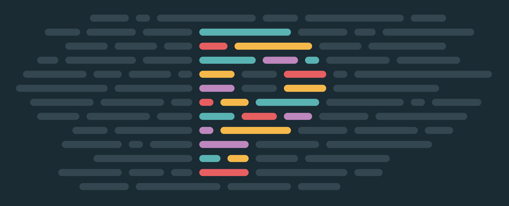
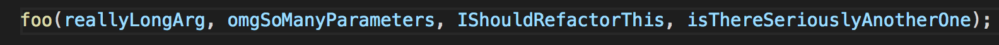
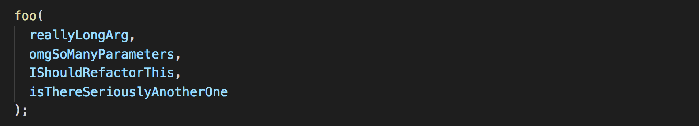

slidenumbers: false

# Prettier
[.text: #ffffff]
[.header: #ffffff]
[.background-color: #000000]
[.footer: www.mulberryhousesoftware.com - github.com/johnwalley - @dowhatimean]



### An Opinionated Code Formatter

^ Prettier is an opinionated code formatter. It enforces a consistent style by parsing your code and re-printing it with its own rules that take the maximum line length into account, wrapping code when necessary.

---
[.background-color: #171717]


---
[.background-color: #171717]


---

## What?

## Why?

## How?

^ This is what speaker notes look like when you are presenting with a external display, or practicing in rehearsal mode.

---
[.background-color: #000000]

# What?

---
[.build-lists: true]
[.list: alignment(left)]

# What is Prettier?

- An **opinionated** code formatter
- Has few options
- Supports many languages

---
[.list: alignment(left)]

# Works with the Tools You Use

- ES2017
- JSX
- TypeScript
- JSON
- CSS
- HTML

---
[.list: alignment(left)]

# What is Prettier?

- Integrates with most editors

---
[.list: alignment(left)]

# Editor Support

- Vim
- Emacs
- VS Code
- Sublime Text
- Atom
- Visual Studio

---
[.background-color: #000000]

# Why?

---

> Nobody loves what prettier does to **their** syntax.
> Everyone loves what prettier does to their **coworkers'** syntax
> -- u/grensley (Reddit)

---

# Why Prettier?

[.build-lists: true]
[.list: alignment(left)]

- You press save and code is formatted
- No need to discuss style in code review

---

# Why Prettier?

[.build-lists: true]
[.list: alignment(left)]

- Building and enforcing a style guide
- Helping newcomers
- Writing code
- Clean up an existing codebase
- Easy to adopt

---
[.background-color: #000000]

# How?

---

# Add prettier to your project

^ We recommend pinning an exact version of prettier in your package.json as we introduce stylistic changes in patch releases.

---
[.background-color: #000000]

```bash
npm install prettier --save-dev --save-exact
```

---
[.build-lists: true]
[.list: alignment(left)]

# Run Prettier...

- in your editor
- when commiting files
- in your CI environment

---

# Prettier vs Linters
[.build-lists: true]
[.list: alignment(left)]

Linters have two categories of rules:

- Formatting rules: eg: max-len, no-mixed-spaces-and-tabs, comma-style...
- Code-quality rules: eg no-unused-vars, no-implicit-globals...

^ Prettier alleviates the need for this whole category of rules! Prettier is going to reprint the entire program from scratch in a consistent way, so it's not possible for the programmer to make a mistake there anymore :)

^ Prettier does nothing to help with those kind of rules. They are also the most important ones provided by linters as they are likely to catch real bugs with your code!

---

# Configuring Prettier

^ Options and Configuration File

---
[.text: #ffffff]
[.header: #ffffff]
[.background-color: #000000]


github.com/johnwalley/prettier-talk

[.footer: www.mulberryhousesoftware.com - github.com/johnwalley - @dowhatimean]